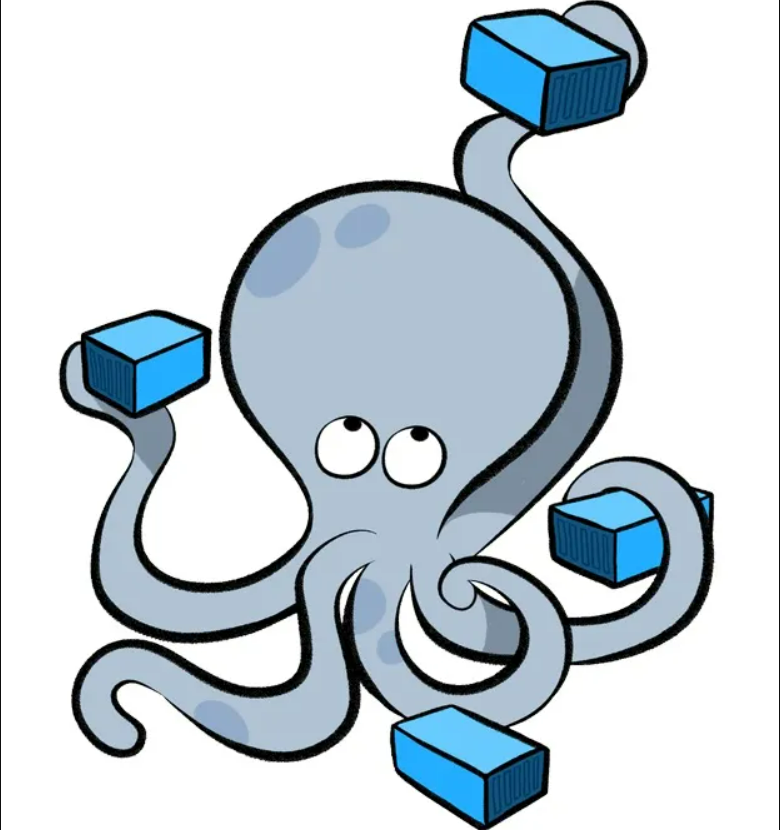
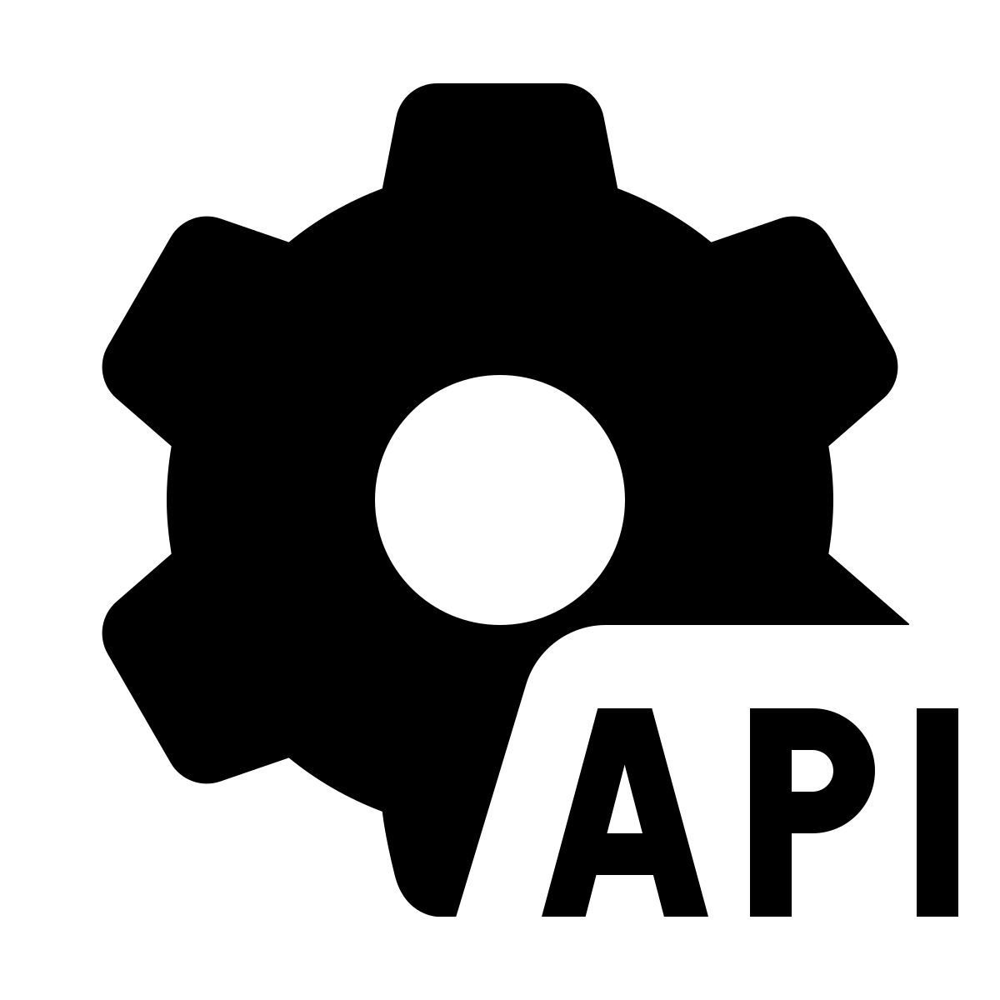

### 👋 Yo, what's up? I'm Denis!

  

### About Me
I'm a Software Engineering student at ITMO University. I love building real projects and solving problems through code. Currently focused on backend development and learning new technologies.

### What I Do
- **C# Development**: Creating web and desktop apps with .NET
- **Backend**: Working with ASP.NET Core, Entity Framework, databases
- **Learning**: Always exploring new tools and frameworks
- **Frontend**: Building interfaces with HTML, CSS, JavaScript

  

---

### 🚀 Technologies:

  <table>
    <tr>
      <td align=center><b>Frontend</b></td>
      <td style="width:290px">
        &nbsp;
        &nbsp;
        &nbsp;
      </td>
    </tr>
    <tr>
      <td align=center><b>Backend</b></td>
      <td>
        &nbsp;
        <!-- &nbsp; -->
        &nbsp;
        <!-- &nbsp; -->
        &nbsp;
      </td>
    </tr>
    <tr>
      <td align=center><b>Databases</b></td>
      <td>
        &nbsp;
        &nbsp;
        &nbsp;
      </td>
    </tr>
    <tr>
      <td align=center><b>Tools</b></td>
      <td>
        &nbsp;
        &nbsp;
        &nbsp;
        &nbsp;
        &nbsp;
      </td>
    </tr>
    <tr>
      <td align=center><b>Infrastructure</b></td>
      <td>
        &nbsp;
        &nbsp;
      </td>
    </tr>
    <tr>
      <td align=center><b>UI</b></td>
      <td>
        &nbsp;
      </td>
    </tr>
      <tr>
      <td align=center><b>Middleware</b></td>
      <td>
        &nbsp;
        &nbsp;
      </td>
    </tr>
    <tr>
      <td align=center><b>Core Features & Concepts</b></td>
      <td>
        &nbsp;
        &nbsp;
        &nbsp;
        <a href="https://learn.microsoft.com/en-us/dotnet/csharp/programming-guide/concepts/linq/" target="_blank" rel="noreferrer">
          <!-- 
        </a>&nbsp; -->
        &nbsp;
        <!-- &nbsp; -->
      </td>
    </tr>
    <!-- <tr>
      <td align=center><b>Currently Exploring</b></td>
      <td style="width:290px">
        &nbsp;
        &nbsp;
        &nbsp;
      </td>
    </tr> -->
  </table>
  <!-- <td style="vertical-align: top;">
      
  </td> -->

### 📊 GitHub Stats & Languages

  <table>
    <tr>
      <td>
        
      </td>
      <td>
        
      </td>
    </tr>
  </table>

<a href="https://github.com/sDenisss/github-profile-trophy"><h2>🏆 Github Profile Trophy</h2></a>

  
  <!--  -->

---
