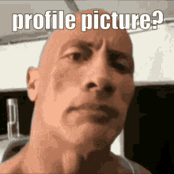

### 👋 Yo, what's up? I'm Denis!

  

I'm a student at ITMO University, where I'm studying software engineering. ITMO is like the Hogwarts of IT in Russia — but instead of magic, we code all day (and night).

Right now, I'm grinding through pet projects, debugging until dawn, and dreaming of the day someone actually reads this README. 😎

What I Do
- 💻 Coding in C#: Building web and desktop apps like a boss.
- 🛠 Tech Stack: SQLite, ASP.NET Core, Entity Framework — I make databases my playground.
- 📚 Always Learning: New tech? Challenge accepted.
- 🖼 Frontend Skills: HTML, CSS, JS — making websites look fresh.

### 🚀 Technologies:

<table>
  <tr>
    <td align=center><b>Frontend</b></td>
    <td style="width:290px">
      &nbsp;
      &nbsp;
      
    </td>
  </tr>
  <tr>
    <td align=center><b>Backend</b></td>
    <td>
      &nbsp;
      &nbsp;
      
      
    </td>
  </tr>
  <tr>
    <td align=center><b>Databases</b></td>
    <td>
      &nbsp;
      
    </td>
  </tr>
  <tr>
    <td align=center><b>Tools</b></td>
    <td>
      &nbsp;
      &nbsp;
      
    </td>
  </tr>
  <tr>
    <td align=center><b>UI</b></td>
    <td>
      
    </td>
  </tr>
</table>

### 📊 GitHub stats:

<a href="https://github.com/sDenisss/github-profile-trophy"><h2>🏆 Github Profile Trophy</h2></a>

---

  

